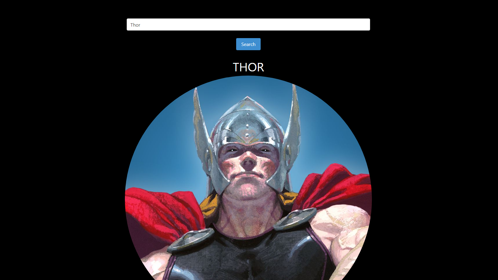
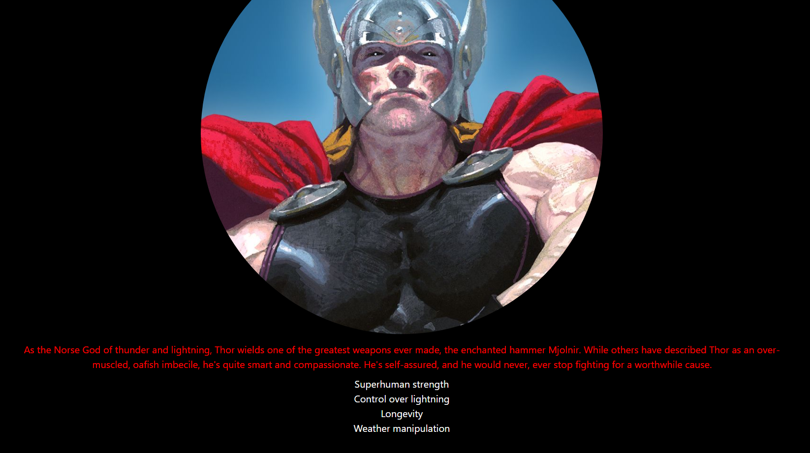

# Marvel Character Directory

## Description

With our dynamically built website any user has the capabilities of searching their favorite characters at any time and finding valuable information regarding any marvel character. The user is presented with an empty page with a search bar at the top where they will search any marvel character they wish. From there, they will be presented with an image of the character based on the marvel comic books depiction of they character they searched. Below this image there will be a short bio of the character (if applicable) that will give a brief overview of the searched character. Right beneath this bio the user will be able to view all of the powers associated with each character they search according to the marvel comic books. This webpage has been built utilizing two separate APIs which have been dynamically integrated into the site allowing the user to find this information stated above. It has also been built utilizing Bulma and CSS for styling purposes which gives the user a clean and responsive design. The HTML and Javascript are both working in sync to provide all the data needed for a great user experience. 

## Visuals

## Usage

This project can be used by any Marvel fan to search their favorite characters data and discover new information on them. The data is exclusive to Marvel characters but has any character within Marvels database. This database will introduce the user with an image based off the Marvel comic books characters and a short description of them. This project can also be used by a beginner coder looking to see how APIs can be integrated into a Javascript project. Theres plenty of information that a beginner coder can get using this project as a resource.

## Authors and Acknowledgment

This project has been created by a small group of students that are in the beginning stages of becoming coders. These students are: Kayla Sullens, Jaime Quezada, and Ignacio Gamez. We worked collaboratively to created this project and are happy to introduce it to you as a user.

## License

N/A

## Link
https://kayla-sullens.github.io/Project-1/
